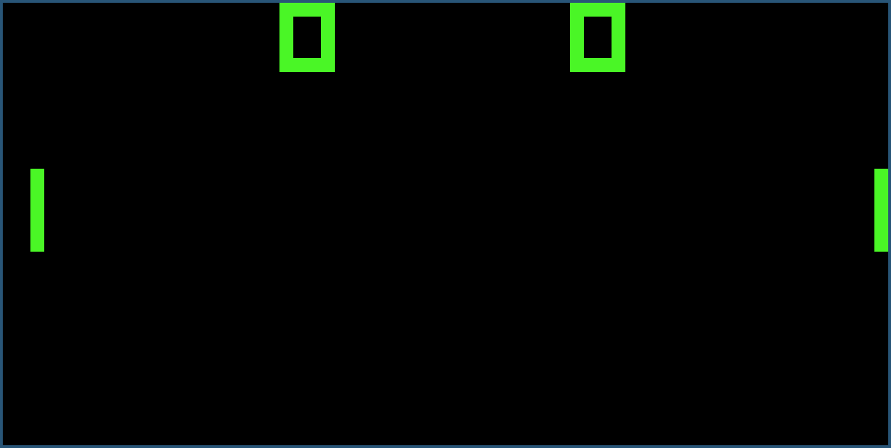

# chip8-cpp
Chip-8 interpreter in C++20

### Build
Install dependencies: `cmake gcc sdl2`
Build:
```
cmake . && make
```

or with Nix:
```
nix build
```

### Usage
```
chip8 rom_file.rom
```
or
```
nix run . -- rom_file.rom
```

### Useful resources

Chip-8:
- https://en.wikipedia.org/wiki/CHIP-8
- http://devernay.free.fr/hacks/chip8/C8TECH10.HTM
- https://multigesture.net/articles/how-to-write-an-emulator-chip-8-interpreter
- https://tobiasvl.github.io/blog/write-a-chip-8-emulator
- https://chip-8.github.io/links

SDL2:
- SDL2 Wiki: https://wiki.libsdl.org/SDL2/CategoryAPI
- Lazy Foo' SDL Tutorials: https://lazyfoo.net/tutorials/SDL/index.php
